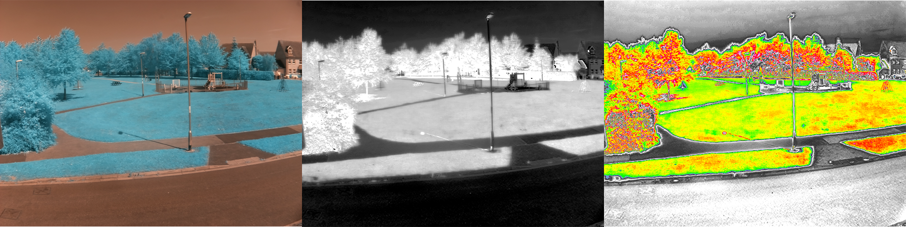

## Introduction

Learn how to fit with special filters, so that you can take images to measure the health of plants. 

**Filters** can be used on cameras to prevent some wavelengths of light from reaching the sensor. For instance, most digital cameras have an infrared filter to stop infrared light from reaching the sensor.

You will:
+ Learn what is meant by Normalised Difference Vegetation Index (NDVI)
+ Convert an image taken with a modified camera so that it can be used to measure NDVI
+ Modify a Raspberry Pi camera module, so it can be used to take NDVI images

--- collapse ---
---
title: You will need
---

### Hardware
+ A Raspberry Pi computer
+ [Raspberry Pi High Quality Camera](https://www.raspberrypi.org/products/raspberry-pi-high-quality-camera/) or [Pi NoIR camera module](https://www.raspberrypi.org/products/pi-noir-camera-v2/).

### Software
You will need to run the following commands on your Raspberry Pi to install the required software libraries:

--- code ---
---
language: linux
line_numbers: false
---
sudo apt update
sudo apt install python3-picamzero libatlas-base-dev python3-numpy python3-opencv
--- /code ---
--- /collapse ---