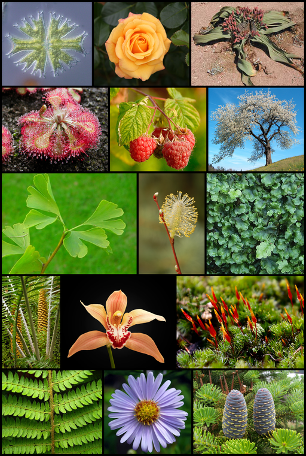
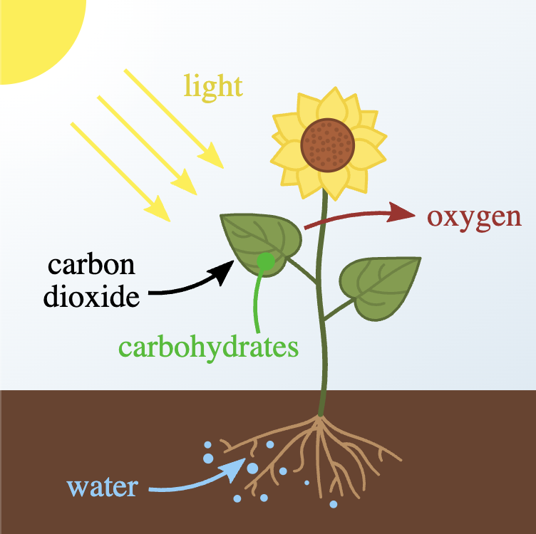
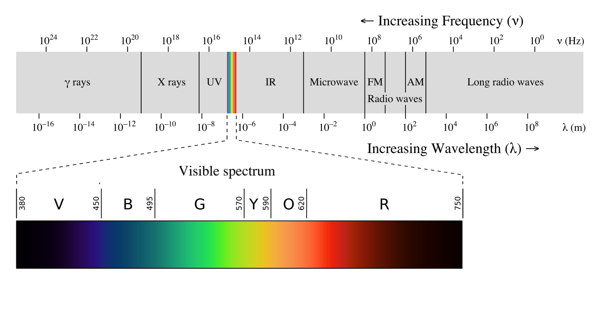

## What is NDVI?

NDVI stands for Normalised Difference Vegetation Index, but what does that mean? In this section you will learn the basics of NDVI.

Plants are typically green in colour, but have you ever wondered why?

The reason most leaves are green is that they contain a chemical called chlorophyll. This chemical helps them to use light from the sun to turn carbon dioxide and water into useful chemicals called carbohydrates, in a process called photosynthesis.

Chlorophyll can't use _all_ of the sun's light. Light from the sun comes in many different forms. When you look at a rainbow, you can see several different colours of light. There are forms of light that humans can't see:
- Ultraviolet (UV) light is invisible to humans. It's a type of light that can cause you to get a sunburn.
- Infrared (IR) light is also invisible to humans, but it's the reason you can feel heat when you place your hands in front of a fire.

There are also other forms of light that you might have heard of, such as microwaves, radio waves, x-rays, and gamma rays.

Chlorophyll can only use some of the light from the sun to perform photosynthesis. It can't use green light, so this is reflected away, and the reason why plants look green.

Plants also don't like infrared radiation very much as it makes them heat up, in the same way you wouldn't want to hold your hands in front of a fire for too long. Plants have evolved to reflect as much infrared light as they can.

Modern cameras can detect many of the different types of light. A picture from a digital camera that also showed infrared light would look a little odd to the human eye. To avoid this, they have special filters added to them, so that infrared light can't reach the sensor. You can see an image below of a park, taken with the infrared filter removed.

There are different types of infrared light. Cameras that can do thermal imaging are actually capturing longwave infrared light. This is different to the shortwave infrared light (Near Infrared) that needs to be filtered out by digital cameras.

This is really useful for measuring the health of plants. If a plant is healthy, it will reflect a lot of near infrared light. If a plant is dying, it will absorb a lot of near infrared light. The blue-green colour in the photo means more infrared light is being reflected.

Look at this image of leaves reflecting light. You can see that infrared light is reflected more from healthy leaves than stressed or dead leaves.

Using a camera without an infrared filter allows us to detect the amount of infrared light that is reflected by plants, and this is how we can measure the health of the plant.
