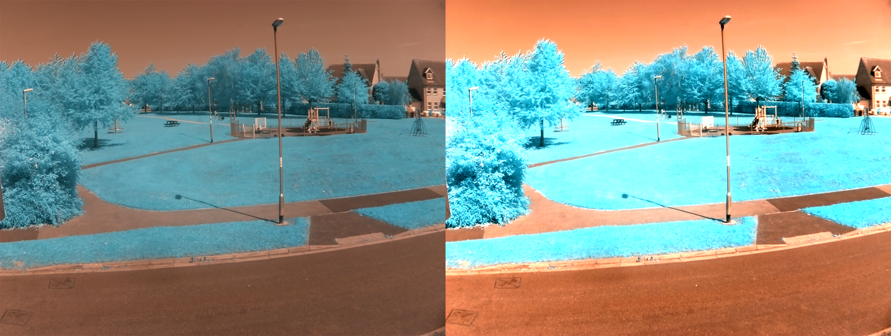

## Increasing the contrast.

Contrast is the difference between brightness or colour in an image. The image below has been split so that the left half has a low contrast and the right side has a high contrast. You need to **increase** the contrast of your image for NDVI.

--- task ---

Create a new function called `contrast_stretch`. It will have a single parameter that will be the `cv2` image object that has been loaded. The function should come after the image has been loaded.

--- code ---
---
language: python
filename: ndvi.py
line_numbers: true
line_number_start:1 
line_highlights: 6
---
import cv2
import numpy as np

park = cv2.imread('park.png')

def contrast_stretch(im):

cv2.namedWindow('Display') # create window
cv2.imshow('Display', park) # display image
cv2.waitKey(0) # wait for key press
--- /code ---

--- /task ---

The image object called `park` is just a big list of numbers. The next task step is to find the largest and smallest of those numbers, using `numpy`.

--- task ---

Add these two lines to your function to find the top brightness of pixels in the image in the top 5% and bottom 5% of your image.

--- code ---
---
language: python
filename: ndvi.py
line_numbers: true
line_number_start:6 
line_highlights: 7-8
---
def contrast_stretch(im):
    in_min = np.percentile(im, 5)
    in_max = np.percentile(im, 95)

--- /code ---

--- /task ---

Now you need to set the maximum brightness and minimum brightness on the new image you are going to create. The brightest a pixel's colour can be is 255 and the lowest is 0.

--- task ---

Add these lines to your function.

--- code ---
---
language: python
filename: ndvi.py
line_numbers: true
line_number_start:6 
line_highlights: 10-11
---
def contrast_stretch(im):
    in_min = np.percentile(im, 5)
    in_max = np.percentile(im, 95)

    out_min = 0.0
    out_max = 255.0
--- /code ---

--- /task ---

Now some calculations need to be performed to change all the pixels in the image so that the image has the full range of contrasts from `0` to `255`.

--- task ---

Add these lines to stretch out the pixel values and return the contrasted image.

--- code ---
---
language: python
filename: ndvi.py
line_numbers: true
line_number_start:6 
line_highlights: 13-17
---
def contrast_stretch(im):
    in_min = np.percentile(im, 5)
    in_max = np.percentile(im, 95)

    out_min = 0.0
    out_max = 255.0

    out = im - in_min
    out *= ((out_min - out_max) / (in_min - in_max))
    out += in_min
    
    return out
--- /code ---

--- /task ---

Now that you have a function to stretch the contrast of the image, you can convert your image and display it on the screen.

--- task ---

Call you `contrast_stretch` function and alter the code so that it is displayed.

--- code ---
---
language: python
filename: ndvi.py
line_numbers: true
line_number_start:1 
line_highlights: 19, 22
---
import cv2
import numpy as np

park = cv2.imread('park.png')

def contrast_stretch(im):
    in_min = np.percentile(im, 5)
    in_max = np.percentile(im, 95)
    
    out_min = 0.0
    out_max = 255.0
    
    out = im - in_min
    out *= ((out_min - out_max) / (in_min - in_max))
    out += in_min
    
    return out

contrasted = contrast_stretch(park)

cv2.namedWindow('Display')
cv2.imshow('Display', contrasted)
cv2.waitKey(0)
--- /code ---
--- /task ---

There should be a noticable difference in the contrast of the two images now.

--- task ---

You can save your high contrast image by adding a single line to the end of your code, so that you can compare the two images in your file browser. It will be called `contrasted.png`

--- code ---
---
language: python
filename: ndvi.py
line_numbers: true
line_number_start:27 
line_highlights: 27
---
cv2.imwrite('contrasted.png', contrasted)
--- /code ---

--- /task ---
