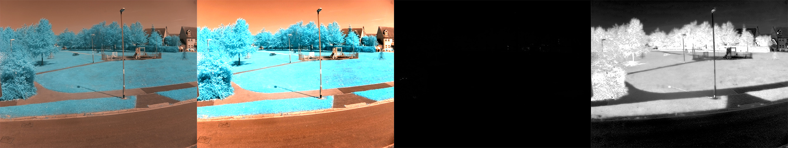

## Calculating NDVI

Now that you have a high contrast image, it's time to do the NDVI calculations. This will take the all the blue pixels and make them brighter and make all the red pixels darker, leaving an image that will be black and white, with the brightest pixels indicating healthy plants and the darkest pixels indicating unhealthy plants or an absence of plants.

--- task ---

Create a new function and call it `calc_ndvi`. It will take a `cv2` image as a parameter.

--- code ---
---
language: python
filename: ndvi.py
line_numbers: true
line_number_start: 7
line_highlights: 21
---
def contrast_stretch(im):
    in_min = np.percentile(im, 5)
    in_max = np.percentile(im, 95)
    
    out_min = 0.0
    out_max = 255.0
    
    out = im - in_min
    out *= ((out_min - out_max) / (in_min - in_max))
    out += in_min
    
    return out

def calc_ndvi(image):
--- /code ---

--- /task ---

To adjust the pixels in the image and only work with red and blue, the image needs splitting into it's three seperate channels. `r` for red, `g` for green, and `b` for blue.

--- task ---

Add this line to your function.

--- code ---
---
language: python
filename: 
line_numbers: true
line_number_start: 27
line_highlights: 28
---
def calc_ndvi(image):
    b, g, r = cv2.split(image)
--- /code ---

--- /task ---

Now the red and blue channels need to be added together and stored as `bottom`. The blue channel can then have the red channel subtracted (remember that red would mean unhealthy plants or no plants), and then divided by the `bottom` calulation. Becuase we're doing a division, we also need to make sure that none of our divisors are `0` or there will be an error.

--- task ---

Add these lines to you function to perform the calculation.

--- code ---
---
language: python
filename: 
line_numbers: true
line_number_start: 27
line_highlights: 29-32
---
def calc_ndvi(image):
    b, g, r = cv2.split(image)
    bottom = (r.astype(float) + b.astype(float))
    bottom[bottom==0] = 0.01
    ndvi = (b.astype(float) - r) /bottom
    return ndvi

--- /code ---

--- /task ---

Now that you have an NDVI function, you can pass in the contrasted image, display it and save it.

--- task ---

Here is the complete code so far. The viewing functions have been removed, so you'll need to view the images in the file browser.

--- code ---
---
language: python
filename: ndvi.py
line_numbers: true
line_number_start: 1
line_highlights: 29, 32, 35
---
import cv2
import numpy as np

park = cv2.imread('park.png')

def contrast_stretch(im):
    in_min = np.percentile(im, 5)
    in_max = np.percentile(im, 95)
    
    out_min = 0.0
    out_max = 255.0
    
    out = im - in_min
    out *= ((out_min - out_max) / (in_min - in_max))
    out += in_min
    
    return out

def calc_ndvi(image):
    b, g, r = cv2.split(image)
    bottom = (r.astype(float) + b.astype(float))
    bottom[bottom==0] = 0.01
    ndvi = (b.astype(float) - r) / bottom
    return ndvi

contrasted = contrast_stretch(park)
ndvi = calc_ndvi(contrasted)

cv2.imwrite('contrasted.png', contrasted)
cv2.imwrite('ndvi.png', ndvi)
--- /code ---

--- /task ---

--- task ---

If you  have a look at your NDVI image, it will probably be pretty dark, although you might catch patches of brighter pixels. To once again enhance the image, it can be run through the `contrast_stretch` function.

--- code ---
---
language: python
filename: ndvi.py
line_numbers: true
line_number_start: 28
line_highlights: 30, 34
---
contrasted = contrast_stretch(park)
ndvi = calc_ndvi(contrasted)
ndvi_contrasted = contrast_stretch(ndvi)

cv2.imwrite('contrasted.png', contrasted)
cv2.imwrite('ndvi.png', ndvi)
cv2.imwrite('ndvi_contrasted.png', ndvi_contrasted)
--- /code ---

Now you can see healthy plant life by the brightness of the pixels in the `ndvi_contrasted.png` image.

--- /task ---

--- save ---