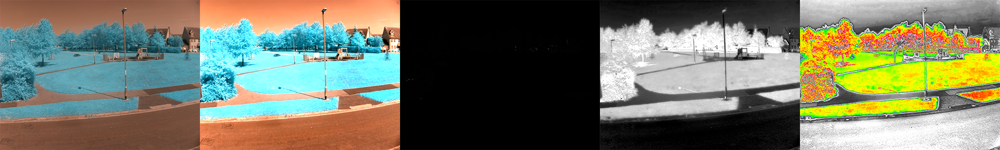

## Colour mapping

You now have an NDVI image, but it's difficult for humans to tell the difference between different shades of grey. You can run the image through a colour mapping process that will turn really bright pixels to the colour red and dark pixels to the colour blue.

A colour map converts pixels in an image from one colour into another. The NDVI image is currently **greyscale**, which means it's black and white, with all the shades in-between.

Because the image is greyscale, each pixel can be represented by a single number from 0 to 255.

The [fastie](https://storage.googleapis.com/publiclab-production/public/system/images/photos/000/006/146/original/NDVI_VGYRM-lut.txt) colour map takes dark pixels and makes them white. Then the brighter the original pixels, the further along the spectrum the colours are shifted. So dark grey pixels become blue, while bright white pixels become red.

--- task ---

Download the [fastiecm.py](images/fastiecm.py){:target='_blank'} colour map. Save it in the same place as your `ndvi.py` file is saved.

--- /task ---

--- task ---

Import the file you've just downloaded into your Python program.

--- code ---
---
language: python
filename: ndvi.py
line_numbers: true
line_number_start: 
line_highlights: 3
---
import cv2
import numpy as np
from fastiecm import fastiecm
--- /code ---

--- /task ---

The current image, that you have saved as `ndvi_contrasted` is not suitable for colour mapping. The numbers stored in the `numpy` array are currently all `floats` or what is commonly known as decimal numbers. They all need converting to whole numbers, or `integers` between `0` and `255`. The `numpy` library can luckily do this for us.

--- task ---

Add the highlighted line to convert your array.

--- code ---
---
language: python
filename: ndvi.py
line_numbers: true
line_number_start: 41
line_highlights: 50
---
display(original, 'Original')
contrasted = contrast_stretch(original)
display(contrasted, 'Contrasted original')
cv2.imwrite('contrasted.png', contrasted)
ndvi = calc_ndvi(contrasted)
display(ndvi, 'NDVI')
ndvi_contrasted = contrast_stretch(ndvi)
display(ndvi_contrasted, 'NDVI Contrasted')
cv2.imwrite('ndvi_contrasted.png', ndvi_contrasted)
color_mapped_prep = ndvi_contrasted.astype(np.uint8)
--- /code ---

--- /task ---

Now the image can be converted using `cv2` colour mapping, and written out as a new file.

--- task ---

Add the highlighted lines below, to convert the image using the fastie colour map, display it, and write a new file.

--- code ---
---
language: python
filename: ndvi.py
line_numbers: true
line_number_start: 50
line_highlights: 51-53
---
color_mapped_prep = ndvi_contrasted.astype(np.uint8)
color_mapped_image = cv2.applyColorMap(color_mapped_prep, fastiecm)
display(color_mapped_image, 'Color mapped')
cv2.imwrite('color_mapped_image.png', color_mapped_image)
--- /code ---

--- /task ---

You should now see the fully colour mapped image in your file browser, saved as `color_mapped.png`.

--- save ---
