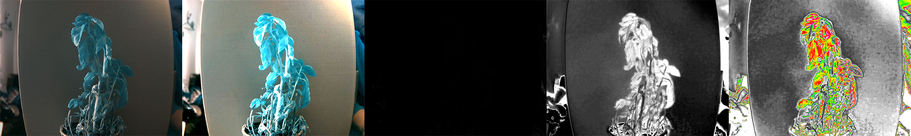

## Create your own NDVI images

<div style="display: flex; flex-wrap: wrap">
<div style="flex-basis: 200px; flex-grow: 1; margin-right: 15px;">
For this step you will need to have a Raspberry Pi HQ Camera and some filters, or the Raspberry Pi NoIR Camera Module. You can then take your own NDVI images, or even enter Mission Space Lab and take NDVI images from the International Space Station.

</div>
</div>

--- collapse ---
---
title: Converting your Raspberry Pi HQ Camera with a RED + Near IR filter
---

- You will need to purchase a [Red and 850nm NIR filter](https://midopt.com/filters/db660850/).
- Follow [this guide](https://www.raspberrypi.org/documentation/hardware/camera/hqcam_filter_removal.md) to remove the IR filter from your Raspberry Pi HQ Camera. **This will void the warranty**. 
- Follow this video guide to install your filter in your camera.
 <video width="320" height="240" controls>
  <source src="images/MidOpt_Filter_Install_HQC.mp4" type="video/mp4">
  Your browser does not support mp4 files.
</video> 

--- /collapse ---

--- collapse ---
---
title: Converting your Raspberry Pi HQ Camera with an R26 Red filter
---

- You will need to purchase a sheet of [Rosculux 26: Light Red filters](https://www.pnta.com/expendables/gels/roscolux/roscolux-26-light-red/).
- Follow [this guide](https://www.raspberrypi.org/documentation/hardware/camera/hqcam_filter_removal.md) to remove the IR filter from your Raspberry Pi HQ Camera. **This will void the warranty**. 
- The red filter can be taped to the front of your HQ camera lens or held in place with a 3D printed part.
- You can download the [STL](images/lens_holder.stl) [OBJ](images/lens_holder.obj) or [SVG](images/lens_holder.svg) and print or laser cut the part yourself.


--- /collapse ---

--- collapse ---
---
title: Using the Raspberry Pi NoIR Camera Module
---

You can use the Raspberry Pi NoIR Camera Module for NDVI images, however, you will need to change one of your lines of code. This is because the Raspberry Pi NoIR Camera uses a blue, instead of a red filter. The red filter is better for capturing NDVI images, but the same kind of effect can be accomplished with a Raspberry Pi NoIR. Instead of subtracting the red channel from the image, you subtract the blue channel.

The line is highlighted and commented in the script below.

--- code ---
---
language: python
filename: ndvi.py
line_numbers: true
line_number_start: 32
line_highlights: 36
---
def calc_ndvi(image):
    b, g, r = cv2.split(image)
    bottom = (r.astype(float) + b.astype(float))
    bottom[bottom==0] = 0.01
    ndvi = (r.astype(float) - b) / bottom # THIS IS THE CHANGED LINE
    return ndvi
--- /code ---

--- /collapse ---

If you need to know how to connect a Camera Module to the Raspberry Pi, and learn the basics of using the PiCamera module, you can have a look at our [Getting started with the camera module guide](https://projects.raspberrypi.org/en/projects/getting-started-with-picamera).

--- task ---

With your Raspberry Pi turned off, connect your camera and then restart your Raspberry Pi.

--- /task ---

The first step is to set up the camera to take a photograph. Resolutions of different cameras vary. If you're using the Raspberry Pi NoIR camera, then you want to use a resolution of `1920x1080`. If you are using the Raspberry Pi HQ Camera, then you can use a resolution of `2582x1952`.

--- task ---

Add these lines to your code, to setup and use the Raspberry Pi camera. Comment out the line that loads the `park.png` image.

--- code ---
---
language: python
filename: ndvi.py
line_numbers: true
line_number_start: 
line_highlights: 4,5,7,8,9,10
---
import cv2
import numpy as np
from fastiecm import fastiecm
from picamera import PiCamera
import picamera.array

cam = PiCamera()
cam.rotation = 180
# cam.resolution = (1920, 1080) # Uncomment if using a Pi Noir camera
cam.resolution = (2592, 1952) # Comment this line if using a Pi Noir camera

# original = cv2.imread('park.png') #Comment out this line, as no longer used
--- /code ---

--- /task ---

Rather than just capture an image with the camera and save it to the SD card, the image is going to be captured as an array of pixel data, so that it can be used by `numpy` and `OpenCV`.

--- task ---

Capture a stream and save it as an array.

--- code ---
---
language: python
filename: ndvi.py
line_numbers: true
line_number_start: 7
line_highlights: 11-13
---
cam = PiCamera()
cam.rotation = 180
# cam.resolution = (1920, 1080) # Uncomment if using a Pi Noir camera
cam.resolution = (2592, 1952) # Comment this line if using a Pi Noir camera
stream = picamera.array.PiRGBArray(cam)
cam.capture(stream, format='bgr', use_video_port=True)
original = stream.array
# original = cv2.imread('park.png') #Comment out this line, as no longer used
--- /code ---

--- /task ---

Instead of the `contrast_stretch` function being run on the `original` image object that you loaded, it will now be run on the saved stream, which is also called `original`.

--- task ---

Add a line near the end of your code, so that you can also write out the `original` array to a file.

--- code ---
---
language: python
filename: ndvi.py
line_numbers: true
line_number_start: 61
line_highlights: 63
---
display(color_mapped_image, 'Color mapped')
cv2.imwrite('color_mapped_image.png', color_mapped_image)
cv2.imwrite('original.png', original)
--- /code ---

--- /task ---

This image shows all the captures of a dying basil plant. You can see that at the base of the plant, the leaves are either dying or dead, where as near the top, there are still some healthy leaves.


--- collapse ---
---
title: Debug - the images from my camera appear red
---

This is a known issue but there is an easy fix.

- Press <kbd>Ctrl</kbd> + <kbd>Alt</kbd> + <kbd>t</kbd> to open up a terminal window.
- Type the following to edit your `config.txt`:
```bash
sudo nano /boot/config.txt
```
- Add the following line to the bottom of the file `awb_auto_is_greyworld=1`.
- Press <kbd>Ctrl</kbd> + <kbd>O</kbd> to save the file and <kbd>Ctrl</kbd> + <kbd>X</kbd> to exit nano.
- You can now close the terminal window, restart your Raspberry Pi and try to take pictures again.

--- /collapse ---

--- save ---

