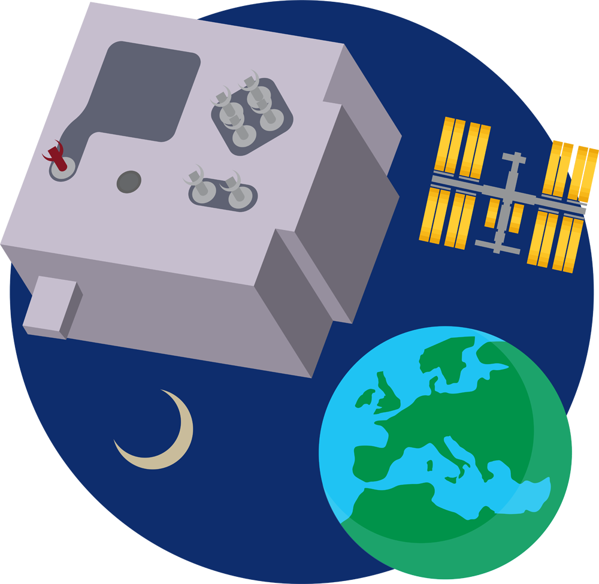
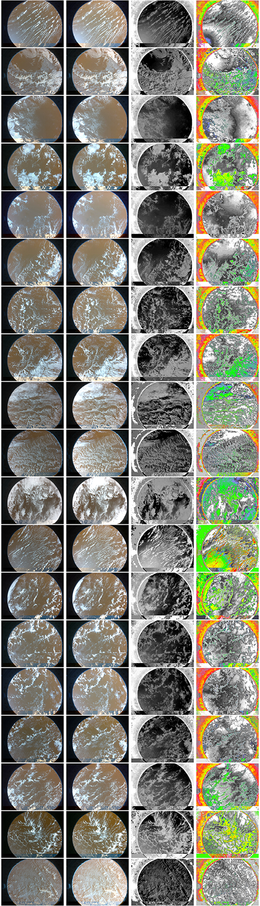

## Mission Space Lab

[Mission Space Lab](https://astro-pi.org/mission-space-lab/) is a competition run by the Raspberry Pi Foundation for ESA member countries and Canada. The competition involves writing code for one of the two Astro Pi units on the ISS. NDVI is a great way to use the camera on one the Astro Pi units to measure plant health on Earth.

{:width="300px"}

Here is an example of NDVI images from the Astro Pi unit called Izzy. Izzy has a PiNoir camera pointed out of the window of the ISS that can be used to capture images of the Earth

If you would like to practice using NDVI on images taken from the ISS, you can use the image below, or look at the images in the [resources folder for this project](https://rpf.io/p/en/astropi-ndvi-get){:target="_blank"}.

